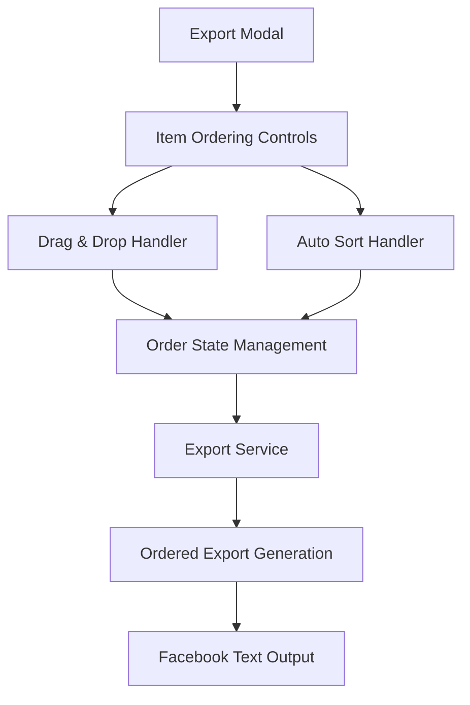
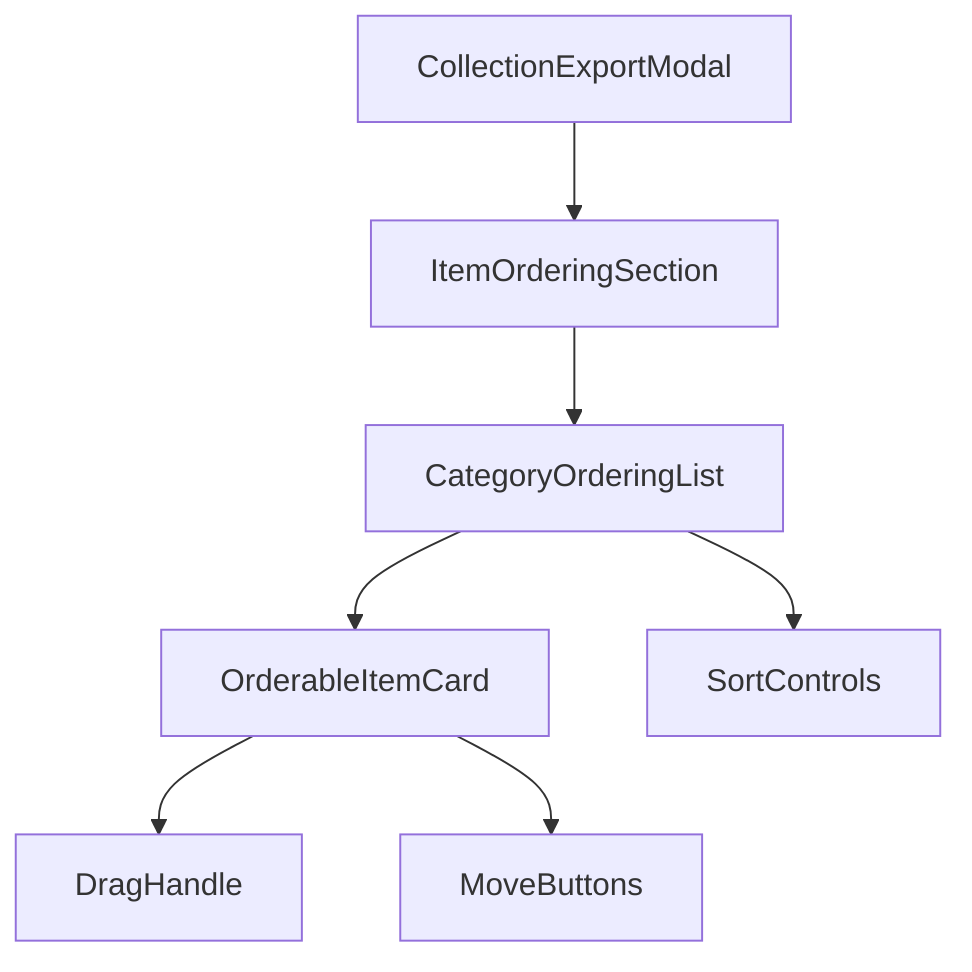

# Design Document: Item Ordering for Collection Export

## Overview

This feature introduces a comprehensive item ordering system for the collection export functionality, allowing users to manually reorder items within each category (PSA Cards, Raw Cards, Sealed Products) and automatically sort by highest to lowest myPrice. The ordering will be applied during Facebook text export generation, providing users with full control over how their items appear in auction listings.

## Code Reuse Analysis

### Existing Components to Leverage

- **CollectionExportModal.tsx**: Base modal for export functionality - will be extended with ordering UI
- **useCollectionExport.ts**: Hook for export operations - will add ordering logic
- **exportUtils.ts**: Export utilities - will add ordering helper functions
- **ExportApiService.ts**: API service - will integrate ordered export requests
- **CreateAuction.tsx**: Contains drag-and-drop patterns for item reordering (lines 8-29 show GripVertical, ArrowUpDown icons)

### Existing Patterns

- **Drag & Drop**: CreateAuction page already implements item reordering with GripVertical icons
- **Price Sorting**: Price-based sorting patterns exist in data tables and auction creation
- **Item Display**: Consistent item card layouts across PSA Cards, Raw Cards, and Sealed Products
- **State Management**: Selection state patterns in export modal for item management

## Architecture

### Data Flow



### Component Hierarchy



## Components and Interfaces

### 1. ItemOrderingSection Component

**Layer 3: UI Building Blocks**

```typescript
interface ItemOrderingSectionProps {
  items: CollectionItem[];
  selectedItemIds: string[];
  itemOrder: string[];
  onReorderItems: (newOrder: string[]) => void;
  onAutoSortByPrice: () => void;
}
```

### 2. CategoryOrderingList Component

**Layer 3: UI Building Blocks**

```typescript
interface CategoryOrderingListProps {
  categoryItems: CollectionItem[];
  categoryType: 'PSA_CARD' | 'RAW_CARD' | 'SEALED_PRODUCT';
  itemOrder: string[];
  onReorderItems: (itemIds: string[], newOrder: string[]) => void;
  onSortCategoryByPrice: (categoryType: string) => void;
}
```

### 3. OrderableItemCard Component

**Layer 3: UI Building Blocks**

```typescript
interface OrderableItemCardProps {
  item: CollectionItem;
  index: number;
  isDragging: boolean;
  onMoveUp: (itemId: string) => void;
  onMoveDown: (itemId: string) => void;
  dragHandleProps?: any;
}
```

### 4. Enhanced Export Hook

**Layer 2: Business Logic & Data Orchestration**

```typescript
interface UseCollectionExportWithOrderingReturn
  extends UseCollectionExportReturn {
  // Ordering state
  itemOrder: string[];
  orderedItems: CollectionItem[];

  // Ordering functions
  reorderItems: (newOrder: string[]) => void;
  moveItemUp: (itemId: string) => void;
  moveItemDown: (itemId: string) => void;
  autoSortByPrice: (ascending?: boolean) => void;
  sortCategoryByPrice: (category: ItemCategory, ascending?: boolean) => void;
  resetOrder: () => void;
}
```

## Data Models

### Item Ordering State

```typescript
interface ItemOrderingState {
  globalOrder: string[]; // All items in desired order
  categoryOrders: {
    PSA_CARD: string[];
    RAW_CARD: string[];
    SEALED_PRODUCT: string[];
  };
  lastSortMethod: 'manual' | 'price_desc' | 'price_asc' | null;
  lastSortTimestamp: Date;
}
```

### Export Request Enhancement

```typescript
interface OrderedExportRequest extends ExportRequest {
  itemOrder?: string[]; // Specific order for items
  sortByPrice?: boolean; // Auto-sort by price
  sortAscending?: boolean; // Sort direction
}
```

### Ordered Collection Item

```typescript
interface OrderedCollectionItem extends CollectionItem {
  orderIndex: number;
  category: 'PSA_CARD' | 'RAW_CARD' | 'SEALED_PRODUCT';
  sortablePrice: number; // Normalized price for consistent sorting
}
```

## Error Handling

### Ordering Error States

```typescript
type OrderingError =
  | 'INVALID_ORDER_SEQUENCE'
  | 'MISSING_ITEMS_IN_ORDER'
  | 'DUPLICATE_ITEMS_IN_ORDER'
  | 'CATEGORY_MISMATCH'
  | 'SORT_OPERATION_FAILED';

interface OrderingErrorContext {
  errorType: OrderingError;
  affectedItems: string[];
  recoveryAction: 'RESET_ORDER' | 'REMOVE_DUPLICATES' | 'RESTORE_BACKUP';
}
```

### Error Recovery

- **Invalid Order**: Reset to original item order
- **Missing Items**: Add missing items to end of order
- **Duplicates**: Remove duplicates, keep first occurrence
- **Sort Failure**: Fallback to alphabetical sorting

## Testing Strategy

### Unit Tests

- **Order Validation**: Test order array validation and error detection
- **Price Sorting**: Test automatic sorting by price in both directions
- **Category Filtering**: Test ordering within specific categories
- **State Management**: Test order state updates and persistence

### Integration Tests

- **Export Integration**: Test ordered export generation with Facebook text format
- **Drag & Drop**: Test manual reordering via drag and drop interactions
- **Mixed Operations**: Test combining manual reordering with auto-sorting
- **Performance**: Test ordering with large item collections (100+ items)

### E2E Tests

- **Full Workflow**: Select items → Reorder manually → Export → Verify text order
- **Auto-Sort Workflow**: Select items → Auto-sort by price → Export → Verify price order
- **Mixed Categories**: Test ordering across all three item categories
- **Error Recovery**: Test error states and recovery mechanisms

## Implementation Details

### Drag & Drop Integration

_Leverage: CreateAuction.tsx drag patterns, react-beautiful-dnd or similar_

- Reuse existing drag handle styling from CreateAuction
- Implement category-aware drag constraints
- Provide visual feedback during drag operations

### Price Sorting Algorithm

_Leverage: Existing price comparison utilities_

```typescript
const sortByPrice = (items: CollectionItem[], ascending: boolean = false) => {
  return items.sort((a, b) => {
    const priceA = a.myPrice || 0;
    const priceB = b.myPrice || 0;
    return ascending ? priceA - priceB : priceB - priceA;
  });
};
```

### Export Text Generation

_Leverage: exportUtils.ts formatting functions_

- Apply item order before text generation
- Maintain category grouping in ordered output
- Preserve existing Facebook post formatting

### State Persistence

_Leverage: Existing localStorage patterns_

- Save ordering preferences per export session
- Restore previous ordering on modal re-open
- Clear state after successful export

## Performance Considerations

### Virtualization

- Use existing VirtualizedItemGrid for large collections
- Implement virtualized drag & drop for 100+ items
- Lazy load ordering controls for better initial render

### Memoization

- Memoize sorted item arrays to prevent unnecessary re-sorts
- Cache drag & drop handlers to avoid recreation
- Optimize order validation functions

### Debouncing

- Debounce manual reordering operations
- Throttle auto-sort triggers during rapid changes
- Batch order state updates

## Technical Requirements

### Dependencies

- **react-beautiful-dnd** or **@dnd-kit/sortable**: Drag & drop functionality
- **lodash**: Array manipulation utilities (if not already included)

### Browser Support

- Modern browsers with ES2018+ support
- Touch device support for mobile drag & drop
- Keyboard navigation for accessibility

### Accessibility

- ARIA labels for drag handles and sort buttons
- Keyboard shortcuts for reordering (Ctrl+Up/Down)
- Screen reader announcements for order changes
- Focus management during drag operations

## Migration Strategy

### Phase 1: Core Ordering

- Implement basic manual reordering with up/down buttons
- Add auto-sort by price functionality
- Integrate with existing export modal

### Phase 2: Enhanced UX

- Add drag & drop interface
- Implement category-specific ordering
- Add order persistence

### Phase 3: Advanced Features

- Bulk ordering operations
- Custom sort criteria beyond price
- Export preview with ordering applied

This design leverages existing codebase patterns while introducing powerful new ordering capabilities that enhance the user experience for collection exports. The implementation follows CLAUDE.md principles with clear separation of concerns and maximum code reuse.
