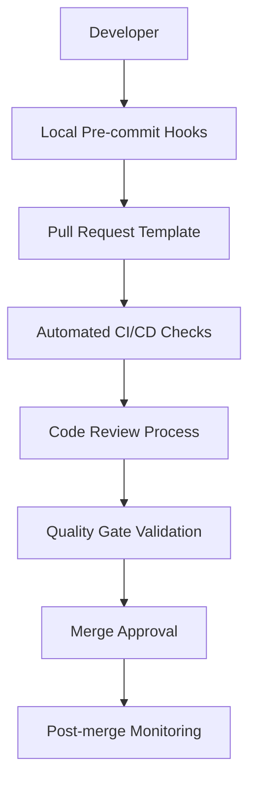
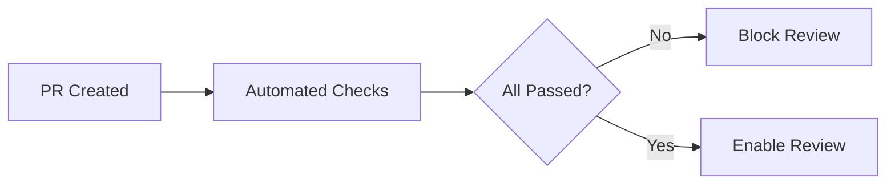

# Pokemon Collection Frontend - Governance Framework

> **Phase 3.3 Implementation** - Comprehensive governance framework for maintaining UI consistency, theme compliance, and code quality standards.

## 📋 Table of Contents

- [🎯 Governance Objectives](#-governance-objectives)
- [🏛️ Framework Architecture](#️-framework-architecture)
- [📜 Contribution Policies](#-contribution-policies)
- [🛡️ Quality Gates](#️-quality-gates)
- [🔍 Automated Enforcement](#-automated-enforcement)
- [📊 Monitoring & Metrics](#-monitoring--metrics)
- [🤝 Review Process](#-review-process)
- [📖 Documentation Standards](#-documentation-standards)
- [⚡ Performance Governance](#-performance-governance)
- [♿ Accessibility Governance](#-accessibility-governance)

## 🎯 Governance Objectives

### Core Principles

1. **Design System Consistency**: Zero tolerance for hardcoded styles
2. **Component Reusability**: Enforce shared component patterns
3. **Accessibility First**: WCAG 2.1 AA compliance mandatory
4. **Performance Excellence**: Bundle size and runtime performance monitoring
5. **Documentation Completeness**: Comprehensive Storybook coverage

### Success Metrics

- **Theme Compliance**: 100% CSS variable usage
- **Component Coverage**: >90% shared UI components with Storybook stories
- **Accessibility Score**: 100% WCAG 2.1 AA compliance
- **Performance Budget**: <5% bundle size increases per PR
- **Test Coverage**: >80% overall, >90% for shared components

## 🏛️ Framework Architecture

### Governance Layers



### Quality Gates Hierarchy

1. **Gate 1**: Local Development
   - ESLint theme rules
   - TypeScript strict mode
   - Pre-commit hooks

2. **Gate 2**: Pull Request Validation
   - Automated theme compliance
   - Bundle size analysis
   - Storybook validation
   - Accessibility testing

3. **Gate 3**: Code Review
   - Design system compliance
   - Component reusability
   - Documentation completeness
   - Performance impact

4. **Gate 4**: Integration Testing
   - Cross-theme compatibility
   - Visual regression testing
   - E2E functionality
   - Performance benchmarks

## 📜 Contribution Policies

### Mandatory Requirements

#### Theme System Compliance
```typescript
// ✅ REQUIRED: CSS variables only
const styles = cva([
  "bg-[var(--theme-primary)]",
  "text-[var(--theme-text-primary)]"
]);

// ❌ VIOLATION: Hardcoded styles
const styles = cva([
  "bg-blue-500",
  "text-white"
]);
```

#### Component Reusability Policy
- **2+ Usage Rule**: UI patterns used more than twice MUST be shared components
- **Location**: All shared components in `src/shared/ui/`
- **Variants**: Support all theme variants (pokemon, glass, cosmic, neural, minimal)
- **Documentation**: Comprehensive Storybook stories required

#### File Structure Compliance
```
src/
├── shared/ui/              # ✅ Shared components ONLY
│   ├── primitives/         # ✅ Base components
│   ├── composite/          # ✅ Complex components  
│   └── index.ts           # ✅ Central exports
├── theme/                  # ✅ Theme system
└── components/            # ✅ Feature-specific only
```

### Enforcement Mechanisms

#### Automated Validation
```bash
# Pre-commit validation
npm run pre-commit  # Lint + TypeScript + Theme rules

# PR validation
npm run validate:all  # All quality gates

# CI/CD pipeline
npm run ci:checks     # Full validation suite
```

#### Manual Review Checklist
- [ ] No hardcoded styles introduced
- [ ] Component supports all theme variants
- [ ] Storybook stories complete
- [ ] Accessibility compliant
- [ ] Performance impact acceptable
- [ ] Documentation updated

## 🛡️ Quality Gates

### Gate 1: Local Development

#### ESLint Theme Rules
```javascript
// Custom rules for theme compliance
'no-restricted-syntax': [
  'error',
  {
    'selector': 'Literal[value=/^(#[0-9a-f]{3,8})/i]',
    'message': 'Use CSS variables instead of hardcoded colors'
  }
]
```

#### Pre-commit Hooks
```json
{
  "husky": {
    "hooks": {
      "pre-commit": "npm run pre-commit",
      "pre-push": "npm run pre-push"
    }
  }
}
```

### Gate 2: Pull Request Validation

#### Automated Checks
1. **Theme Compliance**: ESLint rules + custom validation
2. **Bundle Size**: <5% increase from baseline
3. **Accessibility**: WCAG 2.1 AA compliance via axe-core
4. **Storybook**: Coverage validation for shared components
5. **TypeScript**: Strict mode compilation
6. **Tests**: >80% coverage requirement

#### PR Template Enforcement
- **46 mandatory checkboxes** across 6 categories
- All boxes must be checked before merge approval
- Automated validation of checklist completion

### Gate 3: Code Review Process

#### Review Requirements
- **Minimum**: 2 approvers required
- **Design Review**: For UI changes affecting >1 component
- **Accessibility Review**: For interactive components
- **Performance Review**: For changes affecting bundle size

#### Reviewer Guidelines
```markdown
## Code Review Checklist

### Theme System Review
- [ ] Uses CSS variables exclusively
- [ ] Supports all theme variants
- [ ] Density and motion aware

### Component Review  
- [ ] Follows established patterns
- [ ] Proper TypeScript interfaces
- [ ] Comprehensive prop validation

### Documentation Review
- [ ] Storybook stories complete
- [ ] JSDoc comments present
- [ ] Usage examples included

### Performance Review
- [ ] Bundle impact acceptable
- [ ] No memory leaks
- [ ] Proper React optimizations
```

### Gate 4: Integration Validation

#### Visual Regression Testing
- **Chromatic Integration**: Automated visual diff detection
- **Cross-theme Testing**: All variants tested
- **Responsive Testing**: Multiple viewport sizes
- **Interaction Testing**: User flows validated

#### Performance Monitoring
- **Bundle Size Tracking**: Historical trend analysis
- **Runtime Performance**: Core Web Vitals monitoring
- **Memory Usage**: Heap size tracking
- **Load Time Analysis**: Critical path optimization

## 🔍 Automated Enforcement

### CI/CD Pipeline Configuration

```yaml
# .github/workflows/pr-validation.yml
name: 'PR Validation - UI & Theme Compliance'

jobs:
  theme-compliance:
    name: 'Theme & UI Compliance'
    steps:
      - name: Theme system validation
        run: npm run validate:theme
      - name: Bundle size analysis  
        run: npm run validate:bundle
        
  storybook-validation:
    name: 'Storybook Documentation'
    steps:
      - name: Validate stories
        run: npm run validate:storybook
      - name: Build and test
        run: npm run storybook:test:ci
        
  accessibility-validation:
    name: 'Accessibility (WCAG 2.1 AA)'
    steps:
      - name: Run a11y validation
        run: npm run validate:a11y
```

### Validation Scripts

#### Bundle Size Monitor
```javascript
// scripts/bundle-size-monitor.js
const CONFIG = {
  maxBundleSize: 500 * 1024,  // 500KB
  maxCSSSize: 50 * 1024,      // 50KB  
  maxIncrease: 0.05,          // 5%
};

// Automatic baseline comparison
// Fails PR if limits exceeded
```

#### Accessibility Checker
```javascript
// scripts/accessibility-checker.js
const CONFIG = {
  thresholds: {
    violations: 0,        // Zero violations allowed
    incomplete: 5,        // Max 5 incomplete checks
    passes: 50           // Min 50 passes required
  }
};

// WCAG 2.1 AA compliance validation
// Storybook integration for component testing
```

#### Storybook Validator
```javascript
// scripts/storybook-validator.js
const CONFIG = {
  requiredStories: [
    'Default',
    'AllVariants', 
    'DarkMode',
    'Playground'
  ],
  thresholds: {
    coverage: 0.9,              // 90% coverage
    storyCompleteness: 0.8      // 80% completeness
  }
};

// Auto-generates story templates
// Validates documentation completeness
```

### Real-time Monitoring

#### Performance Dashboard
```typescript
// Performance tracking integration
const performanceMonitor = {
  bundleSize: trackBundleSize(),
  accessibility: trackA11yScore(), 
  storybook: trackStoryCoverage(),
  themeCompliance: trackThemeUsage()
};

// Real-time dashboards for project health
// Automated alerts for threshold violations
```

## 📊 Monitoring & Metrics

### Key Performance Indicators

#### Theme System Health
- **CSS Variable Usage**: 100% target
- **Hardcoded Style Detection**: 0 violations
- **Theme Variant Coverage**: All components support all themes
- **Cross-theme Compatibility**: 100% success rate

#### Component Library Maturity  
- **Shared Component Adoption**: >90% usage
- **Storybook Coverage**: >90% of shared components
- **Documentation Completeness**: >95% JSDoc coverage
- **Reusability Score**: Average component used >3 times

#### Quality Metrics
- **Accessibility Score**: 100% WCAG 2.1 AA
- **Performance Score**: >90 Lighthouse score
- **Bundle Efficiency**: <500KB total, <50KB CSS
- **Test Coverage**: >80% overall, >90% shared components

#### Developer Experience
- **PR Cycle Time**: <2 days average
- **Review Feedback Loop**: <4 hours response time
- **Build Success Rate**: >95% on first attempt
- **Documentation Usage**: >80% developers reference docs

### Monitoring Tools

#### Automated Reporting
```bash
# Daily health check
npm run monitor:health

# Weekly metrics report  
npm run monitor:metrics

# Monthly governance review
npm run monitor:governance
```

#### Dashboard Integration
- **Bundle Analysis**: Webpack Bundle Analyzer integration
- **Accessibility**: axe-core reporting dashboard
- **Performance**: Lighthouse CI integration
- **Coverage**: Istanbul/NYC reporting

### Alerting System

#### Threshold Violations
- **Critical**: Bundle size >10% increase
- **High**: Accessibility violations detected
- **Medium**: Storybook coverage <80%
- **Low**: Documentation gaps identified

#### Notification Channels
- **Slack**: Real-time alerts for threshold violations
- **Email**: Weekly summary reports
- **GitHub**: Automated issue creation for violations
- **Dashboard**: Visual status indicators

## 🤝 Review Process

### Review Stages

#### Stage 1: Automated Pre-review


#### Stage 2: Technical Review
- **Theme Compliance**: Design system adherence
- **Code Quality**: TypeScript, patterns, performance
- **Testing**: Coverage and test quality
- **Documentation**: Completeness and accuracy

#### Stage 3: Design Review (Conditional)
Required for:
- New shared UI components
- Theme system modifications
- Visual changes affecting >2 components
- Accessibility-critical updates

#### Stage 4: Final Approval
- **2+ Approvals**: Required for merge
- **All Checks Green**: Automated validation passed
- **Documentation Updated**: Relevant docs updated
- **Migration Notes**: If breaking changes

### Reviewer Assignment

#### Automatic Assignment
```yaml
# .github/CODEOWNERS
src/shared/ui/          @ui-team @theme-maintainers
src/theme/              @theme-maintainers @design-system-team  
*.stories.tsx           @storybook-maintainers @ui-team
*.test.tsx              @test-maintainers @quality-team
```

#### Review Expertise Matrix
| Area | Primary | Secondary | Accessibility |
|------|---------|-----------|---------------|
| Theme System | @theme-team | @ui-team | @a11y-team |
| Shared Components | @ui-team | @frontend-team | @a11y-team |
| Performance | @perf-team | @frontend-team | - |
| Documentation | @docs-team | @ui-team | @a11y-team |

### Review Quality Standards

#### Review Depth Requirements
- **Surface Review**: Syntax, imports, basic patterns
- **Deep Review**: Logic, performance, accessibility
- **Design Review**: UI consistency, user experience
- **Architecture Review**: System design, scalability

#### Review Feedback Guidelines
```markdown
## Effective Review Feedback

### ✅ Good Feedback
- Specific and actionable
- References documentation/standards  
- Provides code examples
- Explains the "why" behind suggestions

### ❌ Poor Feedback
- Vague or unclear
- Style preferences without rationale
- Blocking without alternatives
- Missing context or examples
```

## 📖 Documentation Standards

### Required Documentation

#### Component Documentation
```typescript
/**
 * PokemonCard - Unified card component for Pokemon collection display
 * 
 * Supports all theme variants and density modes with comprehensive
 * accessibility features and keyboard navigation.
 *
 * @example
 * ```tsx
 * <PokemonCard
 *   variant="pokemon"
 *   pokemon={pokemonData}
 *   onSelect={handleSelect}
 *   density="comfortable"
 * />
 * ```
 */
```

#### Storybook Stories
```typescript
// Required stories for each component
export const Default: Story = {};
export const AllVariants: Story = {};
export const DarkMode: Story = {};  
export const Playground: Story = {};
export const AccessibilityDemo: Story = {};
```

#### Migration Guides
```markdown
## Breaking Change Migration

### Before (v1.x)
```tsx
<OldComponent theme="dark" size="large" />
```

### After (v2.x)  
```tsx
<NewComponent variant="pokemon" size="lg" />
```

### Migration Steps
1. Update imports
2. Replace prop names
3. Test all variants
4. Update tests
```

### Documentation Validation

#### Automated Checks
- **JSDoc Coverage**: >95% for shared components
- **Storybook Coverage**: >90% for shared components  
- **README Accuracy**: Automated link checking
- **Migration Guide Currency**: Version synchronization

#### Manual Review
- **Clarity**: Documentation is understandable
- **Completeness**: All use cases covered
- **Examples**: Working code samples provided
- **Accessibility**: ARIA attributes documented

### Documentation Maintenance

#### Regular Reviews
- **Monthly**: Documentation accuracy check
- **Quarterly**: Comprehensive review and updates
- **Per Release**: Migration guide updates
- **As Needed**: Breaking change documentation

#### Content Management
- **Single Source of Truth**: Avoid documentation duplication
- **Version Control**: Documentation versioning with code
- **Search Integration**: Searchable documentation
- **Feedback Loop**: User feedback incorporation

## ⚡ Performance Governance

### Performance Budget

#### Bundle Size Limits
```javascript
const PERFORMANCE_BUDGET = {
  maxTotalSize: 500 * 1024,    // 500KB total
  maxJavaScript: 450 * 1024,   // 450KB JS
  maxCSS: 50 * 1024,          // 50KB CSS
  maxIncrease: 0.05,          // 5% per PR
  maxComponents: 100,         // Component count limit
};
```

#### Runtime Performance
- **First Contentful Paint**: <1.5s
- **Largest Contentful Paint**: <2.5s
- **Cumulative Layout Shift**: <0.1
- **First Input Delay**: <100ms
- **Time to Interactive**: <3s

### Monitoring & Enforcement

#### Continuous Monitoring
```javascript
// Automated performance tracking
const performanceMetrics = {
  bundleSize: monitorBundleSize(),
  loadTime: monitorPageLoad(),
  memoryUsage: monitorMemoryLeaks(),
  renderTime: monitorComponentRender()
};
```

#### Performance Testing
- **Bundle Analysis**: Every PR and release
- **Lighthouse Audits**: Nightly automated runs
- **Memory Profiling**: Weekly heap dump analysis
- **Load Testing**: Monthly comprehensive testing

### Optimization Strategies

#### Code Optimization
- **Tree Shaking**: Remove unused code
- **Code Splitting**: Route-based and component-based
- **Lazy Loading**: Non-critical components
- **Memoization**: Expensive calculations and renders

#### Asset Optimization
- **Image Optimization**: WebP format, responsive images
- **Font Optimization**: Subset fonts, preload critical fonts
- **CSS Optimization**: Critical CSS inlining
- **JavaScript Minification**: Production builds

#### Runtime Optimization
- **React Optimizations**: memo, useMemo, useCallback
- **Virtual Scrolling**: Large lists and tables
- **Debouncing**: Search and input handlers
- **Caching**: API responses and computed values

## ♿ Accessibility Governance

### WCAG 2.1 AA Compliance

#### Core Requirements
- **Perceivable**: Information presentable to users in ways they can perceive
- **Operable**: User interface components and navigation must be operable
- **Understandable**: Information and UI operation must be understandable
- **Robust**: Content must be robust enough for various assistive technologies

#### Specific Standards
```typescript
// Accessibility requirements
const A11Y_REQUIREMENTS = {
  colorContrast: {
    normal: 4.5,      // 4.5:1 ratio minimum
    large: 3.0,       // 3:1 for large text
    nonText: 3.0      // 3:1 for UI components
  },
  keyboard: {
    focusVisible: true,     // Visible focus indicators
    tabOrder: 'logical',    // Logical tab sequence
    shortcuts: 'documented' // Document keyboard shortcuts
  },
  semantics: {
    headingStructure: 'hierarchical', // Proper heading hierarchy
    landmarks: 'complete',            // ARIA landmarks
    labels: 'descriptive'            // Meaningful labels
  }
};
```

### Automated Accessibility Testing

#### Testing Tools
- **axe-core**: Automated accessibility testing
- **Lighthouse**: Accessibility audits
- **WAVE**: Web accessibility evaluation
- **Pa11y**: Command line accessibility testing

#### Integration Points
```javascript
// Storybook accessibility addon
export default {
  parameters: {
    a11y: {
      config: {
        rules: [
          {
            id: 'color-contrast',
            enabled: true
          },
          {
            id: 'keyboard',
            enabled: true  
          }
        ]
      }
    }
  }
};
```

### Manual Accessibility Testing

#### Testing Procedures
1. **Keyboard Navigation**: Tab through all interactive elements
2. **Screen Reader Testing**: NVDA, JAWS, VoiceOver compatibility
3. **High Contrast Mode**: Windows and macOS high contrast testing
4. **Zoom Testing**: 200% zoom functionality verification
5. **Motion Testing**: Reduced motion preference respect

#### Testing Schedule
- **Per PR**: Automated accessibility checks
- **Weekly**: Manual keyboard navigation testing
- **Monthly**: Screen reader compatibility testing
- **Quarterly**: Comprehensive accessibility audit

### Accessibility Documentation

#### Component Accessibility Notes
```typescript
/**
 * Accessibility Features:
 * - Keyboard navigation with arrow keys
 * - Screen reader announcements for state changes
 * - High contrast mode support
 * - Reduced motion preference respect
 * - ARIA labels and descriptions
 */
```

#### User Guidelines
- **Keyboard Shortcuts**: Document all keyboard interactions
- **Screen Reader**: Provide screen reader instructions
- **High Contrast**: Test and document high contrast behavior
- **Motion**: Document animation and motion preferences

---

## 🎯 Governance Implementation Status

### Phase 3.3 Completion Summary

✅ **Contribution Guidelines**: Comprehensive CONTRIBUTING.md with UI/theme requirements
✅ **PR Template**: 46 mandatory checkboxes across 6 validation categories  
✅ **Automated Checks**: ESLint theme rules, bundle monitoring, accessibility validation
✅ **Quality Gates**: 4-stage validation pipeline with automated enforcement
✅ **Documentation Standards**: Component, Storybook, and migration documentation requirements
✅ **Performance Governance**: Bundle budgets, performance monitoring, optimization strategies
✅ **Accessibility Framework**: WCAG 2.1 AA compliance with automated and manual testing
✅ **CI/CD Integration**: GitHub Actions workflow for comprehensive PR validation
✅ **Monitoring System**: Real-time metrics, alerting, and reporting infrastructure

### Success Metrics Targets

- **Theme Compliance**: 100% CSS variable usage (Zero hardcoded styles)
- **Component Reusability**: >90% shared component adoption  
- **Storybook Coverage**: >90% of shared UI components
- **Accessibility Score**: 100% WCAG 2.1 AA compliance
- **Performance Budget**: <5% bundle size increases, <500KB total
- **Test Coverage**: >80% overall, >90% for shared components
- **Documentation**: >95% JSDoc coverage, complete migration guides

### Next Phase Recommendations

1. **Advanced Monitoring**: Implement real-time performance dashboards
2. **AI-Powered Reviews**: Automated code review suggestions for theme compliance
3. **Usage Analytics**: Track component adoption and usage patterns
4. **Community Feedback**: Establish feedback loops for governance improvements
5. **Training Programs**: Developer education on design system best practices

This governance framework ensures long-term maintainability, consistency, and quality for the Pokemon Collection frontend while providing clear guidelines and automated enforcement mechanisms for all contributors.

---

*This governance framework represents the culmination of Phase 3.3 implementation, establishing a comprehensive system for maintaining UI consistency, theme compliance, and code quality standards in the Pokemon Collection frontend project.*